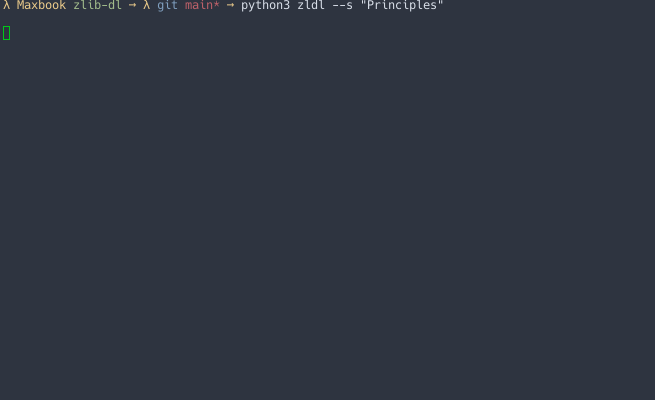

# zlib-dl
Python tool allowing easy books downloads from the terminal 

Update: as of 11/05/2022, the public version of z-library has been shut down. 



## Features 
- Bypass z-library's randomly generated links to downloads
- Obtain a specified number of results
- View several pages of results
- Retrieve metadata without having to go onto z-library itself

## Installation
Clone the repository and install dependencies
```
git clone https://github.com/Nquxii/zlib-dl
cd zlib-dl
```
```
pip install -r requirements.txt
```

Open help section
```
python3 zldl --h
```

Ensure your config.json is set if you don't want to use several parameters each time.

Add zldl to path (so you don't need to cd into zlib-dl every time) Linux/MacOS:
```
ln -s ~[CURRENT DIR]/zldl ~/.local/bin/zldl
```

## Usage
```
python3 zldl [path] --s [query] --n [number of results] --p [number of pages]
```
Number of results defaults to 5 of the top results available. Use 0 to see all search results on the page.

Number of pages is only necessary for larger searches (> 50 results) and is not recommended for usability purposes.


If a path in the command is specified, it will be used. Otherwise, the download_path in config.json will be used.
If none of these options are available, the program will use `assets/` as its download folder.

### Example
View 5 search results for "The Pragmatic Programmer". Download the resulting file in /home/johndoe/Documents/books
```
python3 zldl /home/johndoe/Documents/books --s "The Pragmatic Programmer"
```

View **all** search results on the first page for "Don Quixote". Download the resulting file in ./assets/ (assuming no set path in config.json)
```
python3 zldl --s "Don Quixote" --n 0
```

View 3 pages of **all** search results for "Deep Work". Download the resulting file in ./assets/ (assuming no set path in config.json)
```
python3 zldl --s "Deep Work" --n 0 --p 3
```
